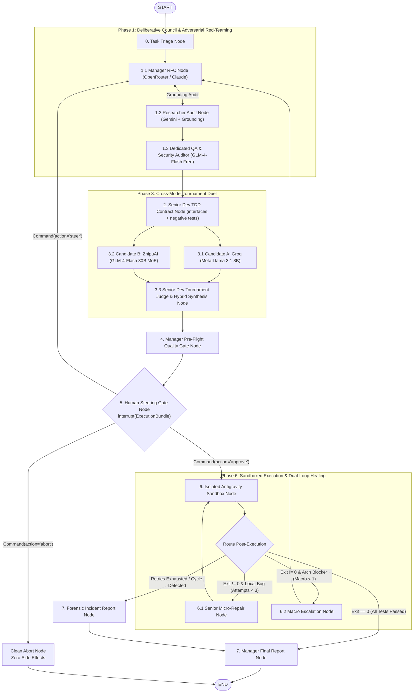

# TriadCouncil: LangGraph Multi-Agent Architecture

## 1. Executive Summary & Framework Foundation

**TriadCouncil** is implemented natively on **LangGraph (0.2+)** and **LangChain**. 

The system models a high-reliability software engineering department featuring **five distinct roles across four independent frontier model families** (Anthropic/DeepSeek on OpenRouter, Google Gemini, Meta Llama on Groq, and ZhipuAI GLM-4-Flash):
- **Cyclic StateGraph**: First-class support for multi-agent loops, tournament drafting, and back-propagation.
- **Dedicated QA & Security Red-Teamer (GLM-4-Flash)**: An independent adversarial agent that attacks plans for vulnerabilities, edge cases, and missing negative tests before code is written.
- **Cross-Model Tournament Duel (Groq vs. GLM-4-Flash)**: Two completely different model families draft competing implementations in parallel (Candidate A from Meta Llama vs. Candidate B from Zhipu GLM).
- **Checkpointer-Driven Human-in-the-Loop (`interrupt()`)**: State serialization (`SqliteSaver` / `MemorySaver`) that pauses execution right before side-effects, presenting an immutable **SHA-256 Integrity Digest** to the operator.
- **Google Antigravity Sandboxed Execution**: Verified runtime execution and evidence capture strictly inside an isolated workspace (`.runs/<run_id>/workspace/`).

---

## 2. Global LangGraph Topology



---

## 3. The 5 Roles & Heterogeneous Provider Allocations

| Role | Provider / Model Family | Backend Integration | Core Responsibility | Cost |
| :--- | :--- | :--- | :--- | :--- |
| **Manager** | **Anthropic / DeepSeek** via OpenRouter | `ChatOpenAI(base_url="https://openrouter.ai/api/v1")` | High-level scoping, RFC authoring, pre-flight gate, final status reporting. | Pay-as-you-go |
| **Researcher** | **Google Gemini 2.5 Flash** | `google-genai` with Search Grounding | Live web search grounding, API deprecation detection, verified documentation citations. | **Free Tier** |
| **QA & Security Red-Teamer** | **ZhipuAI GLM-4-Flash** (30B MoE) | `ChatOpenAI(base_url="https://open.bigmodel.cn/api/paas/v4")` | Adversarial FMEA audit, injection vulnerability checks, negative test scenario formulation. | **100% Free** |
| **Junior Dev 1** | **Meta Llama 3.1 8B** via Groq | `ChatGroq(model_name="llama-3.1-8b-instant")` | Ultra-fast synthesis of **Candidate A** (Lean / StdLib / Direct). | **Free Tier** |
| **Junior Dev 2 (Co-Dev)**| **ZhipuAI GLM-4-Flash** (30B MoE) | `ChatOpenAI(base_url="https://open.bigmodel.cn/api/paas/v4")` | Independent synthesis of **Candidate B** (Modular / Robust / Defensive). | **100% Free** |
| **Senior Dev** | **Google Antigravity SDK** (Gemini) | `Agent(LocalAgentConfig)` | Pre-Gate: TDD test contract authoring, tournament judge, hybrid code synthesis.<br>Post-Gate: Sandboxed file writer, test runner, micro-repair engineer. | Shared with Gemini Key |

---

## 4. Human-in-the-Loop Mechanics (`interrupt()` & Checkpointers)

LangGraph 0.2 replaces brittle manual CLI loops with native graph suspension:

### The Gate Node (`human_steering_gate_node`)
```python
from langgraph.types import interrupt, Command

def human_steering_gate_node(state: TriadCouncilState) -> Command:
    """Suspends the graph prior to any filesystem or command execution.
    Presents the SHA-256 integrity digest, file diffs, and declared commands.
    """
    bundle = state["execution_bundle"]
    
    user_decision = interrupt({
        "type": "CONFIRMATION_REQUIRED",
        "integrity_digest": bundle["bundle_digest"],
        "workspace_path": bundle["workspace_path"],
        "declared_files": list(bundle["source_files"].keys()) + list(bundle["test_files"].keys()),
        "declared_commands": bundle["declared_commands"],
        "options": ["[y] Approve", "[n] Abort", "[s] Steer with Guidance"]
    })
    
    action = user_decision.get("action", "abort").lower()
    
    if action in ["approve", "y"]:
        return Command(update={"approval_status": "APPROVED"}, goto="sandbox_execution_node")
    elif action in ["steer", "s"]:
        return Command(
            update={
                "approval_status": "STEERED",
                "human_feedback": user_decision.get("guidance", ""),
                "council_round": state.get("council_round", 0) + 1
            },
            goto="manager_rfc_node"
        )
    else:
        return Command(update={"approval_status": "ABORTED"}, goto="clean_abort_node")
```
