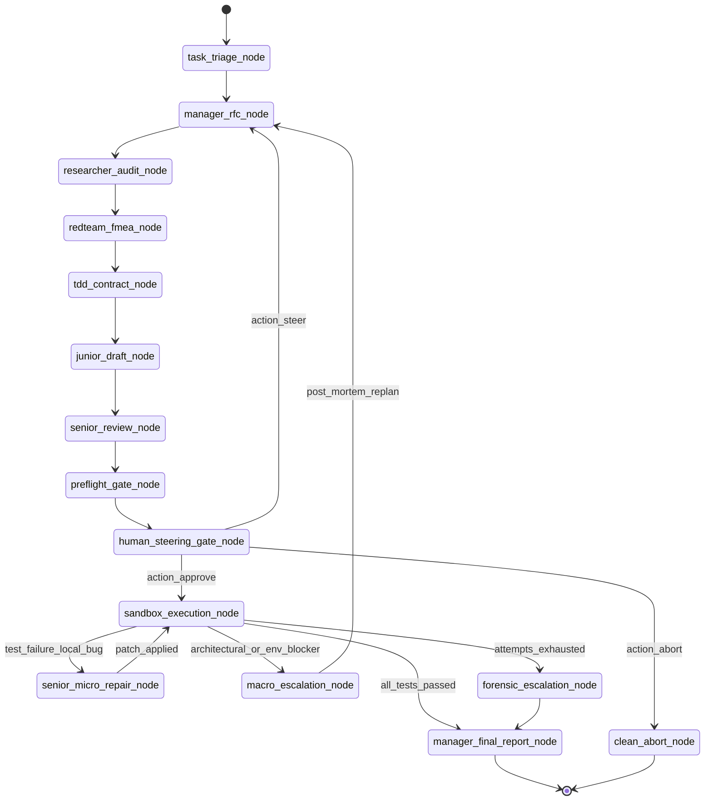

# TriadCouncil: LangGraph StateGraph Specification

This document formally specifies the **LangGraph (0.2+)** `StateGraph` implementation for TriadCouncil.

---

## 1. Graph Topology



---

## 2. Graph Node Catalog

| Node Name | Handler Function | State Reads | State Writes | Invariant Enforced |
| :--- | :--- | :--- | :--- | :--- |
| `task_triage_node` | `triage_task` | `task_prompt` | `triage_metadata` | Validates non-empty prompt. |
| `manager_rfc_node` | `manager_rfc` | `task_prompt`, `human_feedback` | `manager_rfc` | Incorporates human steering constraints if present. |
| `researcher_audit_node`| `researcher_audit` | `manager_rfc` | `researcher_audit` | Calls Gemini Search Grounding for live documentation. |
| `redteam_fmea_node` | `redteam_fmea` | `manager_rfc`, `researcher_audit` | `redteam_fmea` | Maps out failure modes & negative test scenarios. |
| `tdd_contract_node` | `tdd_contract` | `manager_rfc`, `redteam_fmea` | `tdd_contract` | Generates immutable `interfaces.py` & `test_suite.py`. |
| `junior_draft_node` | `junior_draft` | `tdd_contract` | `candidate_a`, `candidate_b` | Synthesizes Candidate A (Lean) and B (Modular). |
| `senior_review_node`| `senior_review` | `candidate_a`, `candidate_b`, `tdd_contract` | `synthesized_code` | Read-only static review; selects/synthesizes hybrid. |
| `preflight_gate_node`| `preflight_gate` | `synthesized_code`, `manager_rfc` | `execution_bundle` | Validates 100% acceptance criteria; computes SHA-256 digest. |
| `human_steering_gate_node`| `human_steering_gate`| `execution_bundle` | `approval_status` | Calls `interrupt()`. Yields digest, diff, and commands. |
| `clean_abort_node` | `clean_abort` | `execution_bundle` | `final_status_report` | Writes zero files; executes zero commands. |
| `sandbox_execution_node`| `sandbox_execution`| `execution_bundle` | `sandbox_result` | Executes strictly in isolated workspace; captures `exit_code`. |
| `senior_micro_repair_node`| `senior_micro_repair`| `sandbox_result`, `synthesized_code`| `synthesized_code`, `micro_repair_count` | Monotonic test progress check ($F_t \le F_{t-1}$). |
| `macro_escalation_node`| `macro_escalation`| `sandbox_result` | `macro_replan_count`, `human_feedback` | Feeds post-mortem diagnosis back to RFC node. |
| `forensic_escalation_node`| `forensic_escalation`| `sandbox_result` | `forensic_report` | Logs failure trace when all retry budgets exhaust. |
| `manager_final_report_node`| `manager_final_report`| `sandbox_result`, `execution_bundle` | `final_status_report` | Generates final customer status report. |

---

## 3. Router Edge Logic

### Human Steering Gate Router
```python
def route_human_gate(state: TriadCouncilState) -> str:
    status = state.get("approval_status", "ABORTED")
    if status == "APPROVED":
        return "sandbox_execution_node"
    elif status == "STEERED":
        return "manager_rfc_node"
    return "clean_abort_node"
```

### Post-Execution Router
```python
def route_post_execution(state: TriadCouncilState) -> str:
    res = state.get("sandbox_result") or {}
    if res.get("exit_code") == 0:
        return "manager_final_report_node"
        
    stderr = res.get("stderr", "")
    micro_count = state.get("micro_repair_count", 0)
    macro_count = state.get("macro_replan_count", 0)
    
    is_arch_blocker = any(k in stderr for k in [
        "ModuleNotFoundError", "ImportError", "EnvironmentError", "OSError"
    ])
    
    if not is_arch_blocker and micro_count < 3:
        current_failures = res.get("failing_tests_count", 999)
        previous_failures = state.get("last_failing_tests_count", 999)
        if current_failures > previous_failures and micro_count > 0:
            return "macro_escalation_node"
        return "senior_micro_repair_node"
        
    elif is_arch_blocker and macro_count < 1:
        return "macro_escalation_node"
        
    return "forensic_escalation_node"
```
